# Taste Skill Brain

<p align="center">
  
</p>

Taste Skill Brain is an evidence-gated Obsidian brain for Giving AI coding agents good taste in frontend design using the open-source Taste Skill framework by Leon Lin — an anti-slop SKILL.md ruleset with three design dials (DESIGN_VARIANCE, MOTION_INTENSITY, VISUAL_DENSITY), audit-first redesigns, an image-first reference pipeline, anti-laziness rules, and a strict pre-flight check that make Claude Code, Cursor, and Codex produce distinctive, non-templated interfaces instead of generic AI slop..

**Current maturity:** scaffolded. This repo is not market-ready until research,
domain adapters, demo verification, audit, and release gates pass.

It ships two artifacts:

- `assets/template-brain/` - the distributable Obsidian vault.
- `SKILL.md` plus `scripts/` - the agent-facing operating layer.

## Buyer

Developers, indie hackers, design engineers, and agencies who build frontends with AI coding agents (Claude Code, Cursor, Codex, Windsurf) and want the output to look intentional and brand-fit rather than templated AI slop.

## Outputs

- Install-and-load quickstart for Claude Code, Cursor, and Codex
- Greenfield build playbook (Prompt 1) end to end
- Audit-first redesign playbook (Prompt 2) with the modernization modes
- The three-dials tuning guide by industry, audience, and mood
- The rules-and-audits reference card (thresholds, em-dash rule, pre-flight check) and an anti-slop concept map

## Quick Start

```bash
python -m pip install -e .
taste-skill-brain demo
taste-skill-brain lint --vault examples/sample-vault
taste-skill-brain report --vault examples/sample-vault --html-only
```

To create a client vault:

```bash
taste-skill-brain new acme --client-name "Acme Co" --owner "Daniel Agrici" --out-dir ~/taste-skill-brain-vaults
taste-skill-brain ingest --vault ~/taste-skill-brain-vaults/acme --file tests/fixtures/sample-source.md
taste-skill-brain synthesize --vault ~/taste-skill-brain-vaults/acme
taste-skill-brain visuals --vault ~/taste-skill-brain-vaults/acme
taste-skill-brain report --vault ~/taste-skill-brain-vaults/acme --html-only
taste-skill-brain next --vault ~/taste-skill-brain-vaults/acme
```

## Boundaries

V1 is advisory and read-only. It does not mutate accounts, systems, books,
pipelines, publishing tools, customer records, or live production data.

Domain claims are release-blocked until `references/current-requirements.md`,
`references/market-research.md`, `references/source-map.md`, and
`references/source-ledger.json` contain dated source material from trustworthy
sources.

## Maturity Gates

1. Scaffolded: product shell, vault, source pack, scripts, tests, and demo exist.
2. Researched: dated trustworthy sources replace placeholder research.
3. Domain-adapted: real domain importer, synthesis, reports, fixtures, and tests exist.
4. Demo-verified: sample vault regenerates deterministically and reports cite sources.
5. Market-ready: audit score is at least 90 with no critical failures.

Scores are capped by maturity. A scaffold cannot become market-ready by edited
markdown alone.

## Research Policy

Use official, primary, or vendor documentation first. Use market or practitioner
sources only as supporting evidence. Do not treat blog roundups or AI summaries
as primary truth. Record evidence in `references/source-ledger.json`; prose-only
research notes do not satisfy the gate.

## Release

```bash
python scripts/package_release.py --version 0.1.0
python scripts/package_release.py --version 1.0.0 --release-type market-ready
```

Release packaging scans for secrets, local paths, symlinks, untracked drift,
and unsafe ZIP entries before writing `dist/RELEASE_MANIFEST.json` and
`dist/SHA256SUMS`. Market-ready packaging also runs `scripts/audit_brain.py`.
