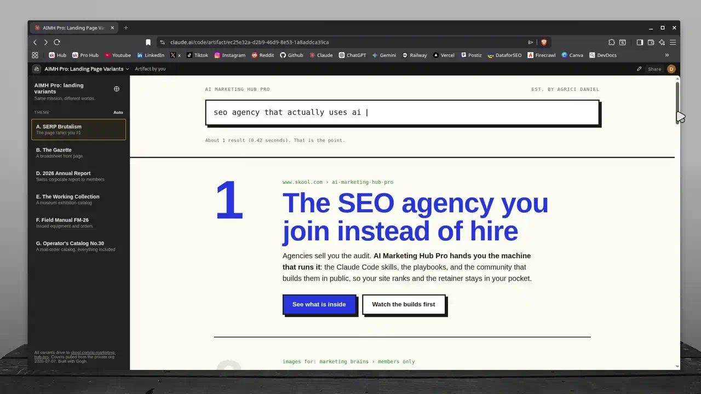
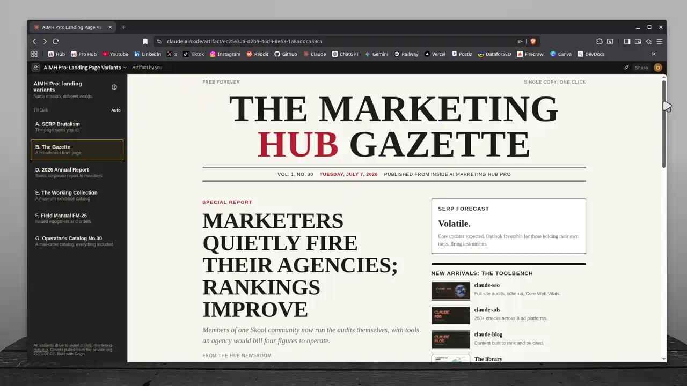
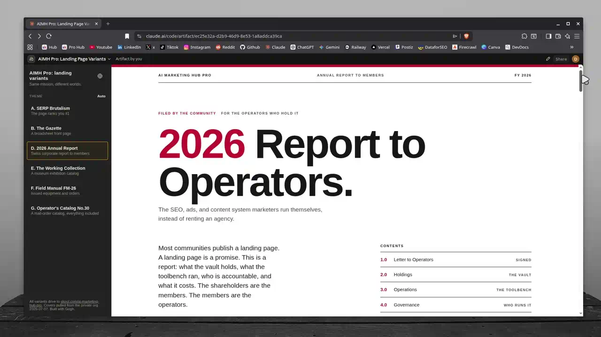
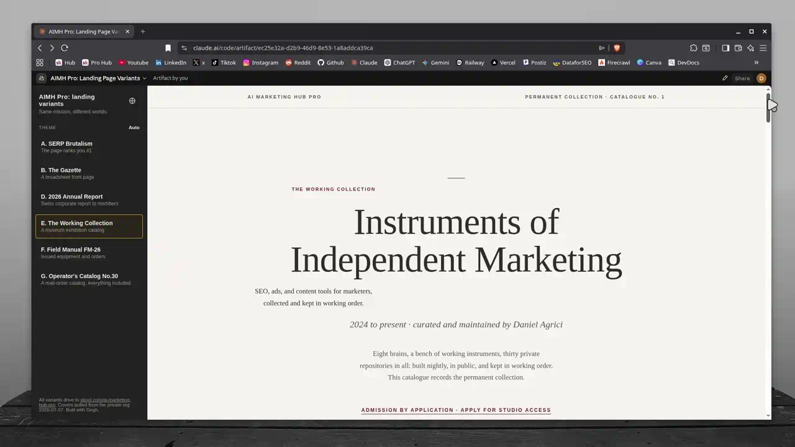
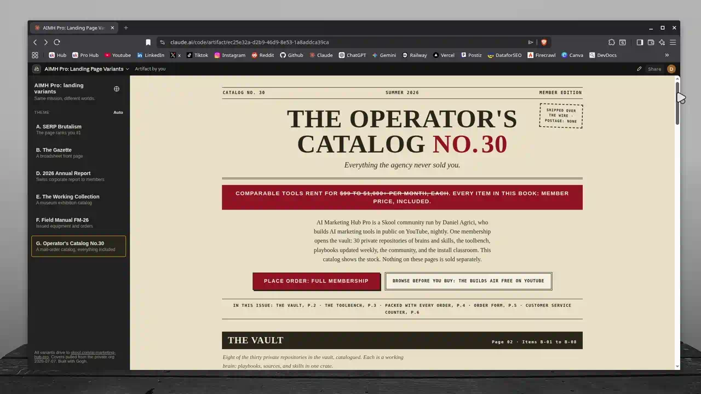

# AIMH Pro landing page variants

Six message-match variants of one landing page (AI Marketing Hub Pro), each built as a
distinct editorial format instead of a generic template. Captured as a reference showcase
for what the Gogh design-skill stack produces.

| Variant | Format |
| --- | --- |
| [A. SERP Brutalism](a-serp-brutalism.html) | The page ranks you #1 |
| [B. The Gazette](b-the-gazette.html) | A broadsheet front page |
| [D. 2026 Annual Report](d-2026-annual-report.html) | Swiss corporate report to members |
| [E. The Working Collection](e-the-working-collection.html) | A museum exhibition catalog |
| [F. Field Manual FM-26](f-field-manual-fm-26.html) | Issued equipment and orders |
| [G. Operator's Catalog No.30](g-operator-s-catalog-no-30.html) | A mail-order catalog, everything included |

Open [index.html](index.html) for a linked gallery view.

### Previews

  
  

  
  

  

No preview recording exists yet for F. Field Manual FM-26.

## Provenance

Built with Gogh in a separate Claude session, captured from a Claude Artifact
(`ec25e32a-d2b9-46d9-8e53-1a8addca39ca`) on 2026-07-07. Extracted, image placeholders
resolved, and wrapped as standalone HTML documents for this repo.

## Scope

Reference only. These are not the live ad-campaign destination pages; they exist here to
show what the six-skill stack can produce, not to serve traffic.
